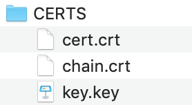

## Person tracker demo using docker|openvino|gstreamer|devosdk libs for streamer cameras monitoring

This demo demonstrates how to build a pipeline to store as events the results of a person tracking application in streaming cameras using docker. In this case, the events are stored at the [Devo](www.devo.com) platform. 

## Requirements

Like this demo generate events to be sent to Devo, it's required to download from the platform the authentication certs. 
See [https://docs.devo.com/confluence/ndt/domain-administration/security-credentials](https://docs.devo.com/confluence/ndt/domain-administration/security-credentials) for more info
about how to download the authentication certs. 
The user certificates must be saved to the CERTS folder 



## How It Works

The demo workflow is the following:

1. The demo application reads tuples of frames from web cameras/videos one by one. For each frame in tuple it runs the person tracking process
2. For each detected object it send an event log to Devo platform with info like like the eventdate, object class, bounding box, etc. This event is sent to Devo
3. Using the --debug choice, the demo visualizes the resulting bounding boxes. 
4. Using the --sendlogs choice, the logs with the detection results, application statics and info/errors are sent
to the Devo tables. By default, 
--tdetect = 'my.app.person_tracker.tracking'
--tstat = 'my.app.person_tracker.stats
--tinfo = 'my.app.person_tracker.info'
 
## Running


Run the docker with the `-h` option to see the following usage message:

```
usage: person_tracker.py [-h] -i I [I ...] [-m M_DETECTOR]
                         [--t_detector T_DETECTOR] [--m_reid M_REID]
                         [--output_video OUTPUT_VIDEO] [--config CONFIG]
                         [--history_file HISTORY_FILE] [-d DEVICE]
                         [-l CPU_EXTENSION] [-p PROCESSING_TIMER]
                         [-dt TDETECT] [-st TSTAT] [-it TINFO]
                         [-ds DEVO_SERVER] [-dp DEVO_PORT] [-b BROADCAST]
                         [-db] [-log] [-s SOURCE]

Person Tracker live demo script

optional arguments:
  -h, --help            show this help message and exit
  -i I [I ...]          Input sources (indexes of cameras or paths to video
                        files)
  -m M_DETECTOR, --m_detector M_DETECTOR
                        Path to the person detection model
  --t_detector T_DETECTOR
                        Threshold for the person detection model
  --m_reid M_REID       Path to the person reidentification model
  --output_video OUTPUT_VIDEO
  --config CONFIG
  --history_file HISTORY_FILE
  -d DEVICE, --device DEVICE
  -l CPU_EXTENSION, --cpu_extension CPU_EXTENSION
                        Optional. Required for CPU custom layers. Absolute
                        path to a shared library with the kernels
                        implementations inside the docker
  -p PROCESSING_TIMER, --processing_timer PROCESSING_TIMER
                        Processing time step (in seconds)
  -dt TDETECT, --tdetect TDETECT
                        Object Detected Table Name.
  -st TSTAT, --tstat TSTAT
                        Stats Table Name.
  -it TINFO, --tinfo TINFO
                        Info Table Name.
  -ds DEVO_SERVER, --devo_server DEVO_SERVER
                        Devo Server.
  -dp DEVO_PORT, --devo_port DEVO_PORT
                        Devo Port.
  -b BROADCAST, --broadcast BROADCAST
                        Streaming broadcast address.
  -db, --debug          Show a window with the image detection results
  -log, --sendlogs      Send Logs to Devo Platform
  -s SOURCE, --source SOURCE
                        Stream source identifier
```

**To configure --devo_server/--devo_port check [https://github.com/DevoInc/python-sdk#endpoints](https://github.com/DevoInc/python-sdk#endpoints). By default is pointing to eu endpoing

Minimum command examples to run the demo:

build the openvinodevosdk/person_tracker docker image
```
./build.sh
```
run the image
```
docker run --rm  -it openvinodevosdk/person_tracker  -i https://stream-us1-bravo.dropcam.com/nexus_aac/f56c9ee1ab08468e917d5dca9a3d0d98/playlist.m3u8?public=8c0wuj0Mkv  -s newyorkcam  --sendlogs
```

another example
```
docker run --rm  -it openvinodevosdk/person_tracker  -i http://213.13.26.11:1935/live/santuario.stream/index.m3u8 -s fatima  --sendlogs
```

* running in local the choices  --net=host --env="DISPLAY" --volume="$HOME/.Xauthority:/root/.Xauthority:rw" --env QT_X11_NO_MITSHM=1 allow access to the console if you are working in local with ubuntu. 
```docker run --rm --net=host --env="DISPLAY" --volume="$HOME/.Xauthority:/root/.Xauthority:rw" --env QT_X11_NO_MITSHM=1 -it openvinodevosdk/person_tracker   -i https://stream-us1-bravo.dropcam.com/nexus_aac/f56c9ee1ab08468e917d5dca9a3d0d98/playlist.m3u8?public=8c0wuj0Mkv  -s petenewyork  --debug
```
use --sendlogs to send logs to Devo platform

## Demo Output


